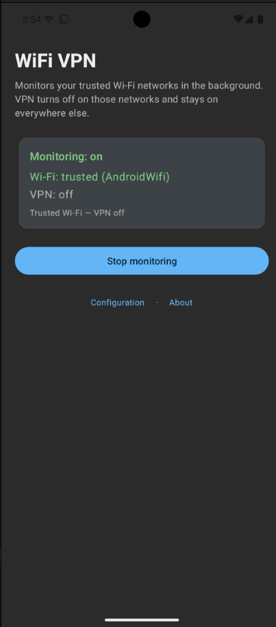
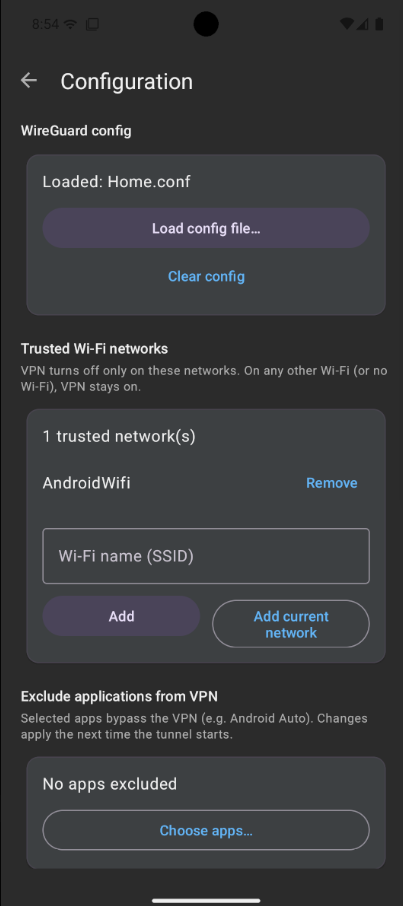
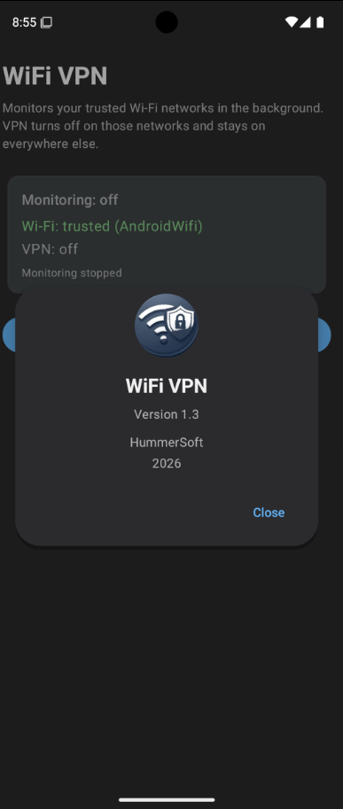

# WiFi VPN

**Version 1.3.1**

Android app that monitors **trusted Wi‑Fi networks** in the background and automatically controls a **WireGuard** tunnel:

| Network state | VPN action |
|---------------|------------|
| Connected to a **trusted** SSID | VPN **off** |
| Other Wi‑Fi, or no Wi‑Fi | VPN **on** |

Built with **Kotlin + Jetpack** (Foreground Service, ConnectivityManager, DataStore, Material 3) and the official WireGuard tunnel library (`com.wireguard.android:tunnel`).

## Screenshots

| Main | Configuration | About |
|:----:|:-------------:|:-----:|
|  |  |  |

- **Main** — status card (monitoring, Wi‑Fi, VPN) and start/stop control  
- **Configuration** — WireGuard config, trusted networks, exclusions, retries, and permissions  
- **About** — app name, version, author, and contact email  

## Contact

- **Email:** [wifi-vpn@mailbox.org](mailto:wifi-vpn@mailbox.org)

## Changelog

### 1.3.1

- VPN retries UI: **−** / **+** text controls (not circular buttons), left-aligned with spacing around the value
- Default VPN retry **attempts = 10**

### 1.3

- **VPN connection retries** configurable on the Configuration page (attempts 1–20, delay 1–120s) before the permission section
- **Weekly permission check** (WorkManager): notifies if location/nearby Wi‑Fi, notifications, VPN permission, or battery exemption is missing or disabled

### 1.2.2

- **Quick Settings tile** subtitle shows **VPN on** / **VPN off** (instead of monitoring text)
- Fix crash when **enabling monitoring from the tile** on Android 14+ (location FGS must start from a foreground Activity; tile now starts via MainActivity)
- Safer FGS start fallback if the location type is rejected

### 1.2.1

- Fix main-screen title overlapping the status bar on Pixel / Android 15+ (edge-to-edge system bar insets)

### 1.2

- **Configuration** extras: **Grant VPN permission**, **Battery optimization** (allow background usage), and **Manage app if unused** (matches system toggle; leave off for reliable monitoring)
- Main screen simplified to status + start/stop monitoring
- **Quick Settings tile**: monochrome white-on-transparent icon; **label** shows tunnel name from the loaded config file; subtitle shows monitoring status
- Tile updates whenever QS is open (non-active `TileService`); note: **wide** tile size is set by the user in system QS edit (apps cannot force default width)
- VPN permission dialogs and messaging remain on the Configuration path

### 1.1.1

- **Quick Settings tile** icon fixed as monochrome white-on-transparent (avoids solid white square)
- Note: tile **width** (small vs wide) is controlled by the system / user

### 1.1

- **Configuration** screen — WireGuard config, trusted Wi‑Fi, excluded apps, and auto-start live on a dedicated page (footer: Configuration · About)
- Clearer **VPN permission** feedback: full dialogs instead of truncated toasts; logcat diagnostics for grant results
- New **app icon** and **Quick Settings tile** icon
- Configuration toolbar spacing so the title clears the system status bar

### 1.0

- Initial release: trusted Wi‑Fi monitoring, WireGuard userspace tunnel, exclusions, auto-start, Quick Settings tile, screen-off SSID handling

## Branches

| Branch | Purpose |
|--------|---------|
| **`release/1.0`** | Stable **v1.0** release line (bugfixes only if needed) |
| **`main`** | Ongoing development for future versions |

Tags: `v1.0` / `v1.1` / `v1.1.1` / `v1.2` / `v1.2.1` / `v1.2.2` / `v1.3` / `v1.3.1` mark release points.

## Features

- **Configuration** page for WireGuard config, trusted networks, app exclusions, VPN retries, VPN permission, battery optimization, unused-app setting, and auto-start
- **Trusted Wi‑Fi list** — add SSIDs manually or from the current network; VPN turns off only on those networks
- **Foreground service** with a persistent status notification while monitoring
- **WireGuard** tunnel via the userspace Go backend (`GoBackend$VpnService`)
- Load config from a `.conf` file (system file picker); stored in DataStore
- **Exclude apps** from the VPN (e.g. Android Auto); multi-select list with search
- Configurable **VPN connect retries** (attempts + delay) with progress in the notification
- **Weekly permission check** with alert notification if critical permissions are disabled
- **Auto-start after reboot** (optional switch; requires config + at least one trusted SSID)
- **Battery optimization** exemption request and **Manage app if unused** shortcut (system settings)
- **Quick Settings tile** to start/stop monitoring (label = tunnel/config name when loaded)
- Location / nearby Wi‑Fi permission (needed to read SSIDs), and notification permission
- **Screen off / locked** — monitor keeps a correct trusted/untrusted decision when the system redacts the SSID; VPN still turns on after leaving trusted Wi‑Fi

## Requirements

- Android 8.0+ (API 26)
- A WireGuard server and a client config (`[Interface]` / `[Peer]`)
- JDK 17, Android SDK 35, Gradle 8.9 / AGP 8.7

## Toolchain (this machine)

Installed under the user home (no root required):

| Component | Location |
|-----------|----------|
| JDK 17 (Temurin) | `~/.local/jdk/jdk-17` |
| Android SDK | `~/Android/Sdk` |
| Platform 35 / Build-Tools 35 / platform-tools / NDK 26.1 | under SDK |
| `local.properties` | `sdk.dir=/home/yurik/Android/Sdk` |

Environment is appended to `~/.bashrc` (`JAVA_HOME`, `ANDROID_HOME`, `PATH`). Open a new terminal or `source ~/.bashrc`.

### Build from CLI

```bash
source ~/.bashrc
cd /path/to/WiFi-VPN
./gradlew assembleDebug
# APK: app/build/outputs/apk/debug/wifi-vpn-debug.apk
adb install -r app/build/outputs/apk/debug/wifi-vpn-debug.apk
```

Release builds use signing from `keystore.properties` (see `app/build.gradle.kts`). Keystore files and that properties file are gitignored.

```bash
./gradlew assembleRelease
# APK: app/build/outputs/apk/release/wifi-vpn-release.apk
adb install -r app/build/outputs/apk/release/wifi-vpn-release.apk
```

### Install release APK

After a successful `assembleRelease`:

```text
app/build/outputs/apk/release/wifi-vpn-release.apk
```

Current release: **1.3.1** (`versionCode` 8). APKs are gitignored; build them locally (or from CI) with the project keystore.

## Setup

1. Open this folder in Android Studio (optional) **or** use Gradle CLI above.
2. Sync Gradle and build the `app` module.
3. Install on a device with USB debugging (VPN APIs required; physical device recommended).
4. Open **Configuration** and tap **Load config file…** to pick a WireGuard `.conf`, for example:

```ini
[Interface]
PrivateKey = <your-client-private-key>
Address = 10.0.0.2/32
DNS = 1.1.1.1

[Peer]
PublicKey = <server-public-key>
AllowedIPs = 0.0.0.0/0, ::/0
Endpoint = vpn.example.com:51820
PersistentKeepalive = 25
```

5. Still in **Configuration**, add at least one **trusted Wi‑Fi** (type the SSID or use **Add current network**). Grant location / nearby Wi‑Fi permission if prompted.
6. Optionally choose **Exclude applications from VPN**.
7. Tap **Grant VPN permission** (system dialog). Enable **Battery optimization** exemption and leave **Manage app if unused** off for reliable background work. Optionally enable **Auto-start after reboot**.
8. On the main screen, tap **Start monitoring**. Optionally add the **WiFi VPN** Quick Settings tile (on Android 16, make the tile **wide** in QS edit if you want the tunnel name visible next to the icon).

## How it works

```
MainActivity / Quick Settings tile / BootReceiver
    │  start-stop; settings via ConfigurationActivity
    ▼
WifiMonitorService  (foreground + persistent notification)
    │  ConnectivityManager + trusted SSID list (DataStore)
    ▼
WifiConnectivityMonitor ──► connected? SSID? trusted?
    │
    ├── On trusted Wi‑Fi  → WireGuardManager.setTunnelDown()
    └── Other / no Wi‑Fi  → WireGuardManager.setTunnelUp(config, excludedApps)
                              (retries on failure)
```

Policy (see `WifiMonitorService`):

- Connected to a **trusted** SSID → VPN off  
- Any other Wi‑Fi, or no Wi‑Fi → VPN on  

WireGuard uses the official userspace Go backend (`GoBackend$VpnService`). Preferences (config, trusted SSIDs, exclusions, auto-start, monitoring flag) live in **DataStore**.

SSID detection notes:

- The monitor service uses foreground-service types **`location|specialUse`** so SSID can still be read while the screen is off (while-in-use location permission).
- If the OS redacts the SSID on lock, the last known name is reused **only** while still associated to the same network (`networkId` / BSSID, supplicant `COMPLETED`). Cache is dropped on disconnect or network change so VPN turns on promptly when you leave trusted Wi‑Fi.

## Permissions

| Permission | Why |
|------------|-----|
| `INTERNET` | Tunnel traffic |
| `ACCESS_NETWORK_STATE` / `ACCESS_WIFI_STATE` | Detect Wi‑Fi |
| `ACCESS_FINE_LOCATION` / `ACCESS_COARSE_LOCATION` | Read current SSID (Android requirement) |
| `NEARBY_WIFI_DEVICES` | Read SSID on Android 13+ without full location use |
| `FOREGROUND_SERVICE` / `FOREGROUND_SERVICE_LOCATION` / `FOREGROUND_SERVICE_SPECIAL_USE` | Keep monitor alive; location type so SSID remains readable with screen off |
| `POST_NOTIFICATIONS` | Status notification (Android 13+) |
| `RECEIVE_BOOT_COMPLETED` | Resume monitoring after reboot when auto-start is on |
| `WAKE_LOCK` | Reliable service work around sleep |
| `QUERY_ALL_PACKAGES` | List installed apps for VPN exclusion |
| `BIND_VPN_SERVICE` (system) | Create the VPN interface |
| `BIND_QUICK_SETTINGS_TILE` (system) | Quick Settings tile |

## Notes

- Battery optimizers can still kill background work; exclude the app if needed.
- Only one VPN can be active on Android; another VPN app will conflict.
- `AllowedIPs = 0.0.0.0/0` routes all traffic through the tunnel when VPN is on.
- SSID reading often needs **location services enabled** on the device, not only the runtime permission.
- Test by leaving a trusted home Wi‑Fi (or turning Wi‑Fi off on mobile data) and watching the notification switch to “Other Wi‑Fi — VPN active” or “No Wi‑Fi — VPN active”.
- Changes to excluded apps apply the **next** time the tunnel starts.

## License

Use freely for personal projects. WireGuard is a registered trademark of Jason A. Donenfeld.
